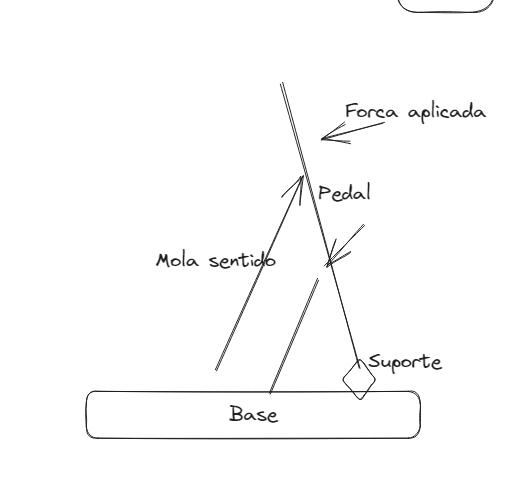
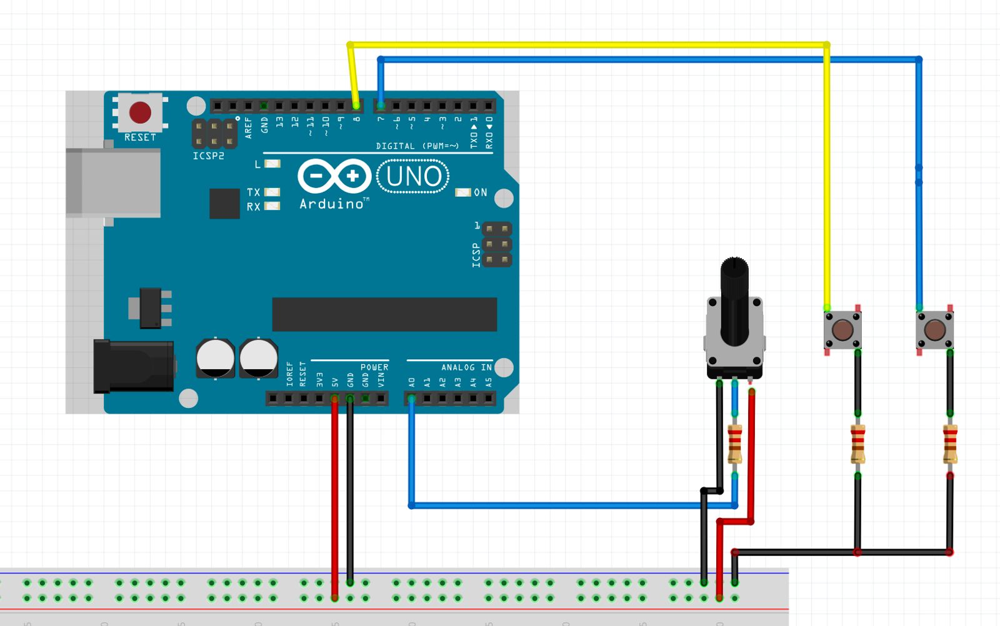

# ProCraftVolante
ProCraftVolante - projeto

Volante -> Analógico (0 a 1024 bytes) -> 512 Meio

> Pedais
	 Acelerador -> 0 e 1 (Digitais)
	 Freio -> 0 e 1 (Digitais)

## Volante esquema

## Pedal esquema

## Material

Para 1 unidade

Elétrica

| Quantidade | Item |
| ---- | ---- |
| 1 | Arduino |
| 1 | Potenciometro |
| -- | Fios |

# Etapas 1

- Código
	- Base
		- [X] Reconhecer leitura do potenciômetro
		- [X] Identificar acelerador
		- [X] Identificar freio
- Montagem
	- Base
		- [X] Esquema para arduino
		- [ ] Fazer as ligações

Extra código

A0 -> Leitura do potenciômetro (Volante)
7 -> Acelerador 
8 -> Freio

(20/01/2024) 
Esquema para leitura de dados (teste),
Da esquerda para a direita temos. (Volante/Freio/Acelerador)

# Etapa 2

Melhorias

