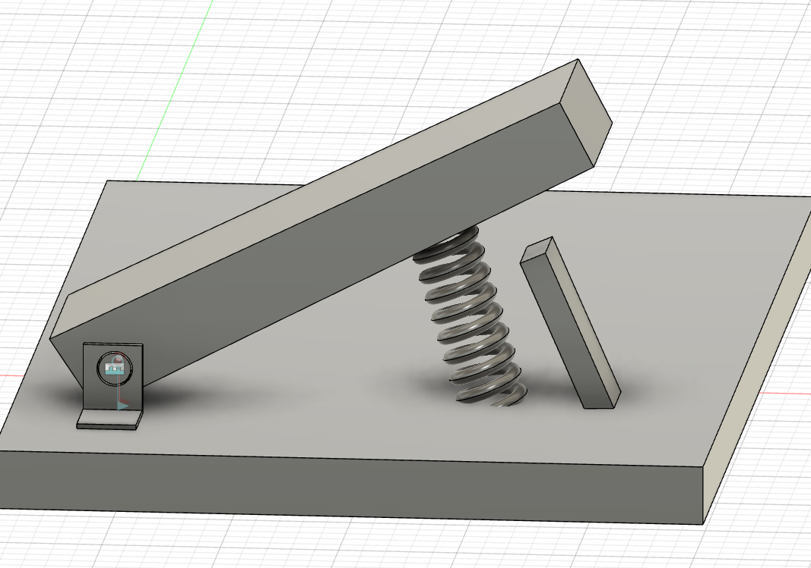

# ProCraftVolante
ProCraftVolante - projeto

Volante -> Analógico (0 a 1024 bytes) -> 512 Meio

> Pedais
	 Acelerador -> 0 e 1 (Digitais)
	 Freio -> 0 e 1 (Digitais)

## Volante esquema

## Pedal esquema

## Material

Para 1 unidade

Elétrica

| Quantidade | Item |
| ---- | ---- |
| 1 | Arduino |
| 1 | Potenciometro |
| -- | Fios |

## Como testar

Por alguma razão, o painel ‘Configurações do controlador de jogo-> Propriedades’ nem sempre funciona, especialmente para joysticks com muitos eixos e botões.

http://www.planetpointy.co.uk/joystick-test-application/

# Etapas 1

- Código
	- Base
		- [X] Reconhecer leitura do potenciômetro
		- [X] Identificar acelerador
		- [X] Identificar freio
- Montagem
	- Base
		- [X] Esquema para arduino
		- [X] Fazer as ligações

Extra código

A0 -> Leitura do potenciômetro (Volante)
7 -> Acelerador 
8 -> Freio

## Avanços

### (20/01/2024) 
Esquema para leitura de dados (teste),
Da esquerda para a direita temos. (Volante/Freio/Acelerador)

### (26/01/2024) 
Além da chegada dos novos componentes, tivemos o marco de nosso primeiro 'volante' funcional.

Vídeo: [https://youtube.com/shorts/sR1wEa1rFtA?feature=share](https://www.youtube.com/shorts/sR1wEa1rFtA)https://www.youtube.com/shorts/sR1wEa1rFtA

### (27/01/2024) 
Tivemos mais um avanço no projeto, o desenvolvimento das funções acelerar e freiar. 
Fizemos os testes necessários e agora vamos partir para a parte mais importante do protótipo.

Vídeo: [https://www.youtube.com/shorts/uhnNjlEjoes](https://www.youtube.com/shorts/uhnNjlEjoes)

### (12/02/2024) 
Desenvolvemos um pouco mais nossas habilidade e iniciamos a motar modelagens para melhor visualização do nosso projeto!
Pedais para aceletador e freio

# Etapa 2

- [X] Acelerador
- [X] Freio
- [ ] Busina
- [ ] Setas {Esquerda/direita}
- [ ] Ligar caminhao
- [ ] Dois Btns extras (Marcha)

Melhorias

